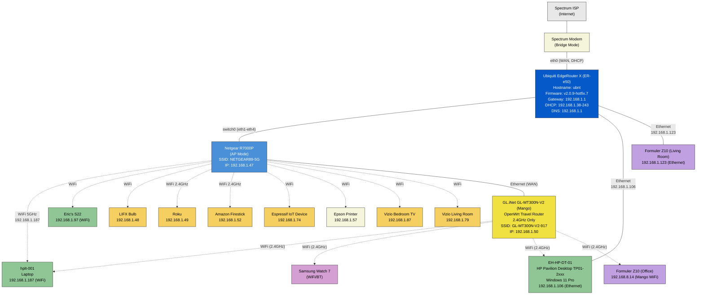

# Arlington Network

Home office network located in Arlington, TX.

## Network Diagram



> **Note:** Solid lines represent wired (Ethernet) connections. Dashed lines represent WiFi connections. The GL.iNet Mango resolves AP isolation issues on the Netgear R7000P.

## EdgeRouter X (Gateway)

| Property | Value |
|----------|-------|
| Model | Ubiquiti EdgeRouter X (ER-e50) |
| Hostname | ubnt |
| Firmware | EdgeRouter v2.0.9-hotfix.7 (2023-06-15) |
| Latest Available | v3.0.1 |
| Management | https://192.168.1.1 |
| SSH | Port 22 (v2) |
| WAN | eth0 (DHCP from Spectrum) |
| LAN | switch0 (eth1-eth4) — 192.168.1.1/24 |
| Secondary Address | 10.0.0.2/24 (on switch0) |
| DHCP Range | 192.168.1.38 - 192.168.1.243 |
| DHCP Lease | 86400s (24 hours) |
| DNS | dnsmasq forwarding on switch0, cache size 150 |
| NAT | Masquerade on eth0 |
| DPI | Enabled |
| Timezone | America/Los_Angeles |

### Firewall Rules

| Ruleset | Default | Rules |
|---------|---------|-------|
| WAN_IN (WAN → LAN) | Drop | 10: Accept established/related; 20: Drop invalid |
| WAN_LOCAL (WAN → Router) | Drop | 10: Accept established/related; 20: Drop invalid |

### Static DHCP Mapping

| Hostname | IP | MAC |
|----------|----|-----|
| DESKTOP-J6LTNGH | 192.168.1.42 | 40:8D:5C:5E:FC:09 |
| GL-MT300N-V2 | 192.168.1.50 | 94:83:C4:86:89:17 |
| bedroom-tv | 192.168.1.87 | 0C:8B:7D:B6:7C:59 |

## Known Devices (EdgeRouter Network)

| IP Address | Hostname | MAC Address | Vendor | Device | Connection |
|------------|----------|-------------|--------|--------|------------|
| 192.168.1.42 | DESKTOP-J6LTNGH | 40:8D:5C:5E:FC:09 | -- | Old desktop (static mapping) | -- |
| 192.168.1.47 | R7000P | 28:80:88:1F:61:FA | Netgear | Netgear R7000P AP | Ethernet |
| 192.168.1.48 | LIFX Bulb | D0:73:D5:00:6D:22 | LIFI Labs | Smart light bulb | Netgear WiFi 2.4G |
| 192.168.1.49 | Livingroom | C8:3A:6B:AA:B3:68 | Roku | Roku streaming player | Netgear WiFi 2.4G |
| 192.168.1.50 | GL-MT300N-V2 | 94:83:C4:86:89:17 | GL Technologies | Mango travel router (static) | Ethernet via Netgear |
| 192.168.1.52 | -- | AC:63:BE:11:ED:DE | Amazon | Amazon Firestick | Netgear WiFi 2.4G |
| 192.168.1.57 | EPSON5FDDDF | B0:E8:92:5F:DD:DF | Seiko Epson | Epson printer | Netgear WiFi 2.4G |
| 192.168.1.65 | iPhone | 56:A5:28:50:9C:50 | *(randomized MAC)* | iPhone | Netgear WiFi 2.4G |
| 192.168.1.74 | ESP_00A606 | B8:F0:09:00:A6:06 | Espressif | IoT device (smart plug?) | Netgear WiFi 2.4G |
| 192.168.1.79 | -- | 2C:64:1F:B5:D3:E8 | Vizio | Vizio TV (living room) | Netgear WiFi 2.4G |
| 192.168.1.87 | bedroom-tv | 0C:8B:7D:B6:7C:59 | Vizio | Vizio TV (bedroom, static) | Netgear WiFi 2.4G |
| 192.168.1.97 | Eric-s-S22 | C6:6A:65:D6:D9:EA | *(randomized MAC)* | Samsung S22 | Netgear WiFi |
| 192.168.1.106 | EH-HP-DT-01 | 48:9E:BD:A0:4F:FF | HP | HP Pavilion Desktop | Ethernet |
| 192.168.1.107 | EH-HP-DT-01 | 38:D5:7A:8A:C5:77 | Foxconn/Cloud Network | HP Desktop (WiFi adapter) | Netgear WiFi |
| 192.168.1.123 | -- | 68:4E:05:7A:91:1A | FN-LINK | Formuler Z10 (living room) | Ethernet |
| 192.168.1.165 | Formuler-Z10 | 5C:C5:63:F1:B7:26 | FN-LINK | Formuler Z10 (office) — stale | *(was Netgear WiFi, now Mango only)* |
| 192.168.1.182 | -- | CC:95:D7:AB:65:71 | Vizio | Vizio TV (third?) | Netgear WiFi |
| 192.168.1.187 | hplt-001 | 58:02:05:47:B3:4A | AzureWave | HP Laptop | Netgear WiFi 5G |
| 192.168.1.188 | -- | 28:24:C9:64:54:DC | Amazon | Amazon device (Echo?) | Netgear WiFi |
| 192.168.1.191 | -- | AE:82:46:AF:C4:AC | *(randomized MAC)* | Unknown mobile device | Netgear WiFi |
| 192.168.1.192 | -- | 46:A8:0D:CD:A4:96 | *(randomized MAC)* | Unknown mobile device | Netgear WiFi |
| 192.168.1.62 | -- | 14:2D:27:9B:82:9E | Hon Hai/Foxconn | Unknown | -- |
| 192.168.1.82 | -- | AC:82:47:4E:D5:4F | Intel | Unknown | -- |
| 192.168.1.159 | -- | F8:E4:3B:88:6C:E6 | ASIX Electronics | USB Ethernet adapter | -- |
| 192.168.1.38 | -- | 00:05:1B:A1:E4:6C | Magic Control Technology | Unknown | -- |

## Netgear R7000P (Access Point)

| Property | Value |
|----------|-------|
| Mode | Access Point (AP mode, not routing) |
| IP | 192.168.1.47 (DHCP from EdgeRouter) |
| MAC | 28:80:88:1F:61:FA |
| SSID | NETGEAR89-5G |
| Uplink | Ethernet to EdgeRouter switch0 |

## GL.iNet GL-MT300N-V2 (Mango)

| Property | Value |
|----------|-------|
| Model | GL.iNet GL-MT300N-V2 (Mango) |
| Firmware | GL.iNet v4.3.28 (OpenWrt) |
| WAN IP | 192.168.1.50 (static DHCP from EdgeRouter) |
| LAN IP | 192.168.8.1 |
| MAC | 94:83:C4:86:89:17 |
| SSID | GL-MT300N-V2-917 |
| WiFi Security | WPA2-PSK |
| WiFi Band | 2.4GHz only |
| Management | http://192.168.8.1 (from LAN side) |
| SSH | Port 22 (root, from LAN side) |
| Uplink | Ethernet to Netgear R7000P (passes through to EdgeRouter) |
| Purpose | Temporary workaround for Netgear AP client isolation during development, testing, and debugging sessions (e.g., Watch-to-Laptop pairing, Formuler-to-Laptop remote debugging). Not intended as a primary network — devices should use the Netgear/EdgeRouter network for normal operation. |

### Mango Static DHCP Mappings

| Hostname | IP | MAC |
|----------|----|-----|
| EH-HP-DT-01 | 192.168.8.10 | 38:D5:7A:8A:C5:77 |
| hplt-001 | 192.168.8.11 | 58:02:05:47:B3:4A |
| Eric-s-S22 | 192.168.8.12 | AA:3F:CA:4E:60:6D |
| SM-L315U (Watch) | 192.168.8.13 | 8E:52:5F:EF:B4:6F |
| Formuler-Z10 (Office) | 192.168.8.14 | 5C:C5:63:F1:B7:26 |

## Formuler Z10 Streaming Boxes

Two Formuler Z10 units, both using FN-LINK WiFi modules (different OUI prefixes from different production batches).

| Location | MAC | Primary Connection | Network IP |
|----------|-----|-------------------|------------|
| Office | 5C:C5:63:F1:B7:26 | Mango WiFi (2.4GHz) | 192.168.8.14 |
| Living Room | 68:4E:05:7A:91:1A | Ethernet to EdgeRouter | 192.168.1.123 |

## Desktop Details (EH-HP-DT-01)

| Property | Value |
|----------|-------|
| Manufacturer | HP |
| Model | HP Pavilion Desktop TP01-2xxx |
| OS | Windows 11 Pro |
| Hostname | EH-HP-DT-01 |
| Ethernet | Realtek Gaming GbE Family Controller (48:9E:BD:A0:4F:FF) |
| WiFi | Realtek RTL8852AE WiFi 6 802.11ax (38:D5:7A:8A:C5:77) |
| Bluetooth | 38:D5:7A:8A:C5:78 |
| Hyper-V | Enabled (WSL + Default Switch) |
| RDP | Enabled (port 3389) |

### Virtual Network Adapters

| Adapter | IP Address | Subnet | Purpose |
|---------|------------|--------|---------|
| vEthernet (Default Switch) | 172.21.48.1 | 255.255.240.0 | Hyper-V default NAT |
| vEthernet (WSL) | 172.23.192.1 | 255.255.240.0 | WSL2 networking |

## Laptop Details (hplt-001)

| Property | Value |
|----------|-------|
| Hostname | hplt-001 |
| IP | 192.168.1.187 |
| MAC | 58:02:05:47:B3:4A |
| Connection | WiFi via Netgear R7000P |

## Known Issues

### ~~Netgear R7000P AP/Client Isolation~~ (Resolved)
The R7000P enforces WiFi client isolation with no exposed setting to disable it. This prevented WiFi-to-WiFi device communication (RDP, remote debugging, Samsung Watch discovery).

**Resolution:** GL.iNet GL-MT300N-V2 (Mango) travel router deployed at 192.168.1.50, connected via Ethernet through the Netgear to the EdgeRouter. Devices that need to communicate locally (e.g., Watch pairing, Formuler remote debugging, RDP over WiFi) temporarily connect to the Mango's WiFi (GL-MT300N-V2-917) during development/testing sessions. Devices should return to the Netgear/EdgeRouter network for normal day-to-day use.

### WiFi Network Profile
When the desktop connects via WiFi, Windows may classify the connection as **Public**, which blocks inbound RDP. Fix:
```powershell
Set-NetConnectionProfile -InterfaceAlias "Wi-Fi" -NetworkCategory Private
```

### EdgeRouter Firmware
Currently on v2.0.9-hotfix.7 — v3.0.1 is available. Consider upgrading.
