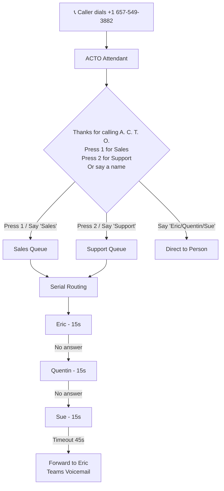

# Microsoft Teams Voice Configuration Guide

## Overview

This document covers the Teams Phone System configuration for A CTO, LLC, including the Auto Attendant, Call Queues, and lessons learned during setup and management.

**Last Updated:** January 2026

---

## Current Configuration

### Main Phone Number

| Component | Phone Number | Purpose |
|-----------|--------------|---------|
| ACTO Attendant (Auto Attendant) | **+1 657-549-3882** | Main incoming line |

### Resource Accounts

| Name | Email | Type | License |
|------|-------|------|---------|
| Auto Attendant | autoattendant@a-cto.com | Auto Attendant | Phone System Virtual User |
| Sales Call Queue | salescallqueue@a-cto.com | Call Queue | Phone System Virtual User |
| Support Call Queue | supportcallqueue@a-cto.com | Call Queue | Phone System Virtual User |

### Call Flow



**Note:** Dial-by-name is enabled. Callers can say a name to be routed directly, but no directory listing is provided.

### After Hours

- Forwards directly to +1 949-296-5389 (Eric)

### Holidays

- **July 4th**: Forwards to Quentin

---

## Sales Call Queue Configuration

| Setting | Value |
|---------|-------|
| **Identity** | 5249573b-93fe-49d9-8b84-d0dc0fb7a178 |
| **Routing Method** | Serial (sequential) |
| **Agent Alert Time** | 15 seconds |
| **Agents (in order)** | 1. Eric Halsey, 2. Quentin Halsey, 3. Sue Halsey |
| **Timeout** | 45 seconds |
| **Timeout Action** | Forward to Eric (Teams voicemail) |
| **Presence-Based Routing** | Enabled |
| **Conference Mode** | Disabled |

## Support Queue Configuration

| Setting | Value |
|---------|-------|
| **Identity** | 18dada23-3862-4469-bc96-ea666217243b |
| **Routing Method** | Serial (sequential) |
| **Agent Alert Time** | 15 seconds |
| **Agents (in order)** | 1. Eric Halsey, 2. Quentin Halsey, 3. Sue Halsey |
| **Timeout** | 45 seconds |
| **Timeout Action** | Forward to Eric (Teams voicemail) |
| **Presence-Based Routing** | Enabled |
| **Conference Mode** | Disabled |

---

### PowerShell Commands Used

```powershell
# Connect to Teams
Import-Module MicrosoftTeams
Connect-MicrosoftTeams

# Get user IDs
$quentin = (Get-CsOnlineUser -Identity "quentin.halsey@a-cto.com").Identity
$sue = (Get-CsOnlineUser -Identity "shalsey@a-cto.com").Identity
$eric = (Get-CsOnlineUser -Identity "ehalsey@a-cto.com").Identity

# Update the call queue to serial routing with 15-second rollover
# Order: Eric first, then Quentin, then Sue
Set-CsCallQueue -Identity "5249573b-93fe-49d9-8b84-d0dc0fb7a178" `
    -RoutingMethod Serial `
    -Users @($eric, $quentin, $sue) `
    -DistributionLists @() `
    -ChannelId "" `
    -AgentAlertTime 15
```

---

## Licensing Summary

### Current Licenses

| License | SKU | Consumed | Available |
|---------|-----|----------|-----------|
| Phone System Virtual User | PHONESYSTEM_VIRTUALUSER | 3 | 3 |
| Communication Credits | MCOPSTNC | 1 | 10,000,000 |
| Microsoft 365 Business Premium (no Teams) | M365_BUSINESS_PREMIUM | 4 | 15 |
| Microsoft Teams Enterprise | TEAMS_ENTERPRISE | 4 | 15 |

### User License Assignments

| User | M365 Business Premium | Teams Enterprise | Teams Phone | Enterprise Voice |
|------|----------------------|------------------|-------------|------------------|
| Eric Halsey | Yes | Yes | Yes | Yes |
| Quentin Halsey | Yes | Yes | Yes | Yes |
| Sue Halsey | Yes | Yes | Yes | Yes |

---

## Lessons Learned

### 1. PowerShell API is Stricter Than Teams Admin Center UI

**Issue:** When attempting to modify the Auto Attendant via PowerShell (`Set-CsAutoAttendant`), the API returns:
> "User (xxx) is not Enterprise Voice enabled in either online or on-premises environment"

**Cause:** The PowerShell API validates ALL user references in the Auto Attendant configuration, including:
- Authorized users
- Holiday call flow targets
- Direct transfer targets

**Workaround:** Use the Teams Admin Center (https://admin.teams.microsoft.com) for Auto Attendant changes when users don't have Enterprise Voice enabled.

**References:**
- [Set up Auto attendant and Call queue authorized users](https://learn.microsoft.com/en-us/microsoftteams/aa-cq-authorized-users)

---

### 2. Call Queue Agents MUST Have Enterprise Voice Enabled

**Correction:** Previous assumption was incorrect. Microsoft documentation states:

> "Agents who receive calls from a Call queue must be Enterprise Voice enabled online or on-premises users."

**Requirements for Call Queue Agents:**
- **Teams Phone Standard license** (~$8/user/month) or equivalent
- **Enterprise Voice enabled** (can be set via PowerShell after licensing)
- TeamsOnly mode for Teams client

**To enable Enterprise Voice after assigning license:**
```powershell
Set-CsPhoneNumberAssignment -Identity "user@domain.com" -EnterpriseVoiceEnabled $true
```

**References:**
- [Plan for Teams Auto attendants and Call queues](https://learn.microsoft.com/en-us/microsoftteams/plan-auto-attendant-call-queue)

---

### 3. Microsoft 365 Business Premium Does NOT Include Teams Phone

**Common Misconception:** M365 Business Premium includes full Teams calling capabilities.

**Reality:** Business Premium includes:
- Teams meetings and chat
- Basic Teams calling (internal only)
- Does NOT include Phone System (Teams Phone)

**To Enable Full PSTN Calling:**
- Add **Teams Phone Standard** license (~$8/user/month), OR
- Add **Teams Phone with Calling Plan** bundle (~$15/user/month)

**References:**
- [Microsoft Teams add-on licenses](https://learn.microsoft.com/en-us/microsoftteams/teams-add-on-licensing/microsoft-teams-add-on-licensing)

---

### 4. PowerShell Session Persistence

**Issue:** Each `pwsh -Command "..."` invocation starts a new PowerShell process. Authentication doesn't persist between commands.

**Solutions:**
1. **Run multiple commands in a single session:**
   ```powershell
   pwsh -Command '
   Import-Module MicrosoftTeams
   Connect-MicrosoftTeams | Out-Null
   # All subsequent commands here
   '
   ```

2. **Use token caching:**
   ```powershell
   Connect-MicrosoftTeams -TokenCacheLocation $HOME/.teams_token_cache
   ```

3. **Service Principal authentication (for automation):**
   ```powershell
   Connect-MicrosoftTeams -ApplicationId <AppId> -TenantId <TenantId> -Certificate <Cert>
   ```

---

### 5. MicrosoftTeams PowerShell Module Installation

**On Windows with PowerShell 7 (pwsh):**
```powershell
Install-Module -Name MicrosoftTeams -Force -AllowClobber -Scope CurrentUser -Repository PSGallery
```

**Note:** Windows PowerShell 5.1 may have issues with `Install-Module` if PowerShellGet is outdated. PowerShell 7 (`pwsh`) is recommended.

---

### 6. Clearing Channel-Based Agent Routing

**Issue:** When switching a Call Queue from Teams channel-based routing to individual users, you must clear both:
- `DistributionLists`
- `ChannelId`

**Error if not cleared:**
> "Distribution list cannot be empty if channel threadId is provided"

**Solution:**
```powershell
Set-CsCallQueue -Identity "<queue-id>" `
    -Users @($user1, $user2, $user3) `
    -DistributionLists @() `
    -ChannelId ""
```

---

### 7. Teams PowerShell Service Principal Authentication Requires Certificates

**Issue:** Attempting to use client secrets with Teams PowerShell service principals fails. The `-ServicePrincipal` parameter doesn't support client secret authentication.

**Cause:** Teams PowerShell module requires certificate-based authentication for service principals, not client secrets.

**Solution:**
1. Create a self-signed certificate:
   ```powershell
   $cert = New-SelfSignedCertificate -Subject "CN=ACTO-Internal-Automation" `
       -CertStoreLocation "Cert:\CurrentUser\My" -KeyExportPolicy Exportable `
       -KeySpec Signature -KeyLength 2048 -KeyAlgorithm RSA -HashAlgorithm SHA256 `
       -NotAfter (Get-Date).AddYears(2)
   ```

2. Upload the public certificate to the app registration in Entra ID:
   ```bash
   az ad app credential reset --id "<app-id>" --cert "@cert.cer" --append
   ```

3. Assign admin roles (Teams Administrator or Teams Telephony Administrator):
   - Activate the role in Entra ID
   - Add the service principal as a member

4. Connect using certificate:
   ```powershell
   Connect-MicrosoftTeams -ApplicationId $appId -TenantId $tenantId -CertificateThumbprint $thumbprint
   ```

---

## Useful PowerShell Commands

### View All Call Queues
```powershell
Get-CsCallQueue | Select-Object Name, Identity, RoutingMethod, AgentAlertTime
```

### View Call Queue Details
```powershell
Get-CsCallQueue -Identity "<queue-id>" | ConvertTo-Json -Depth 5
```

### View All Auto Attendants
```powershell
Get-CsAutoAttendant | Select-Object Name, Identity
```

### View Auto Attendant Details
```powershell
Get-CsAutoAttendant -Identity "<aa-id>" | ConvertTo-Json -Depth 10
```

### View Resource Account Phone Numbers
```powershell
Get-CsOnlineApplicationInstance | Select-Object DisplayName, UserPrincipalName, PhoneNumber
```

### Check User Enterprise Voice Status
```powershell
Get-CsOnlineUser -Identity "user@domain.com" | Select-Object DisplayName, EnterpriseVoiceEnabled
```

---

## Teams Admin Center URLs

| Purpose | URL |
|---------|-----|
| Teams Admin Center | https://admin.teams.microsoft.com |
| Call Queues | https://admin.teams.microsoft.com/voice/call-queues |
| Auto Attendants | https://admin.teams.microsoft.com/voice/auto-attendants |
| Phone Numbers | https://admin.teams.microsoft.com/voice/phone-numbers |
| Resource Accounts | https://admin.teams.microsoft.com/voice/resource-accounts |

---

## Automation Service Principal

A service principal has been created for automation tasks including Teams management, Microsoft Graph API access, and infrastructure automation.

### Service Principal Details

| Property | Value |
|----------|-------|
| **Display Name** | ACTO Internal Automation |
| **Application (Client) ID** | `11b1509b-d570-4d3a-b46e-032215808864` |
| **Tenant ID** | `f8ac75ce-d250-407e-b8cb-e05f5b4cd913` |
| **Object ID** | `c40d44c8-af16-4161-8992-0b9f24798866` |
| **Secret Expiration** | January 2028 |
| **Certificate Thumbprint** | `23B468A0F2F8A32B673F2CEBBCA9F00B7A3F10A6` |
| **Certificate Expiration** | January 2028 |

### Entra ID Admin Roles

| Role | Purpose |
|------|---------|
| Teams Administrator | Full management of Microsoft Teams service |
| Teams Telephony Administrator | Manage voice/telephony features, call queues, auto attendants |

### API Permissions (Application)

| Permission | Description |
|------------|-------------|
| `Directory.Read.All` | Read directory data |
| `User.Read.All` | Read all users' full profiles |
| `Organization.Read.All` | Read organization information |
| `Group.Read.All` | Read all groups |
| `TeamSettings.Read.All` | Read Teams settings |
| `Team.ReadBasic.All` | Read basic Teams info |

### Credentials Storage (Azure Key Vault)

| Property | Value |
|----------|-------|
| **Key Vault Name** | acto-automation-kv |
| **Key Vault URI** | https://acto-automation-kv.vault.azure.net/ |
| **Resource Group** | acto-infra-rg |
| **Location** | westus2 |

**Secrets and Certificates stored:**
| Name | Type | Description |
|------|------|-------------|
| `acto-internal-automation-cert` | Certificate | PFX certificate with private key for authentication |
| `acto-internal-automation-cert-thumbprint` | Secret | Certificate thumbprint for quick reference |
| `acto-internal-automation-client-secret` | Secret | Client secret (backup authentication method) |
| `acto-internal-automation-app-id` | Secret | Application/Client ID |
| `acto-internal-automation-tenant-id` | Secret | Azure AD Tenant ID |

### Usage Examples

#### Connect to Microsoft Teams (Recommended - Certificate Auth)
```powershell
# Certificate must be installed in CurrentUser certificate store
# The certificate was created and is already installed on the dev machine

Import-Module MicrosoftTeams

$appId = "11b1509b-d570-4d3a-b46e-032215808864"
$tenantId = "f8ac75ce-d250-407e-b8cb-e05f5b4cd913"
$thumbprint = "23B468A0F2F8A32B673F2CEBBCA9F00B7A3F10A6"

Connect-MicrosoftTeams -ApplicationId $appId -TenantId $tenantId -CertificateThumbprint $thumbprint

# Now you can manage Teams resources without interactive auth
Get-CsCallQueue | Select-Object Name, Identity
Get-CsAutoAttendant | Select-Object Name, Identity
```

#### Retrieve Certificate from Key Vault (for new machines)
```powershell
# Download certificate from Key Vault and import to local store
az keyvault certificate download --vault-name acto-automation-kv --name acto-internal-automation-cert --file "$env:TEMP\acto-automation.pfx" --encoding PEM

# Or retrieve the PFX with private key
az keyvault secret download --vault-name acto-automation-kv --name acto-internal-automation-cert --file "$env:TEMP\acto-automation.pfx" --encoding base64

# Import to certificate store
Import-PfxCertificate -FilePath "$env:TEMP\acto-automation.pfx" -CertStoreLocation Cert:\CurrentUser\My
```

#### Connect to Microsoft Graph
```powershell
# Using certificate-based auth with Microsoft Graph
Connect-MgGraph -ClientId $appId -TenantId $tenantId -CertificateThumbprint $thumbprint
```

---

## Azure Infrastructure

### Resource Groups

| Name | Location | Purpose |
|------|----------|---------|
| acto-infra-rg | westus2 | Infrastructure resources (Key Vault, automation) |
| acto-dns-prod-rg | westus2 | DNS resources |

### Key Vault Access

The Key Vault uses **Access Policies** (not RBAC). Current access:
- **Eric Halsey** - Full access to keys, secrets, certificates, storage

To grant access to another user or service principal:
```bash
az keyvault set-policy --name acto-automation-kv \
    --object-id "<user-or-sp-object-id>" \
    --secret-permissions get list \
    --key-permissions get list
```

---

## References

- [Plan for Teams Auto attendants and Call queues](https://learn.microsoft.com/en-us/microsoftteams/plan-auto-attendant-call-queue)
- [Create a Call queue in Microsoft Teams](https://learn.microsoft.com/en-us/microsoftteams/create-a-phone-system-call-queue)
- [Set up a Microsoft Teams Auto attendant](https://learn.microsoft.com/en-us/microsoftteams/create-a-phone-system-auto-attendant)
- [PowerShell cmdlet reference for Auto attendants and Call queues](https://learn.microsoft.com/en-us/microsoftteams/call-queue-auto-attendant-cmdlets)
- [Microsoft Teams Phone Resource Account licenses](https://learn.microsoft.com/en-us/microsoftteams/teams-add-on-licensing/virtual-user)
- [Set up Auto attendant and Call queue authorized users](https://learn.microsoft.com/en-us/microsoftteams/aa-cq-authorized-users)
